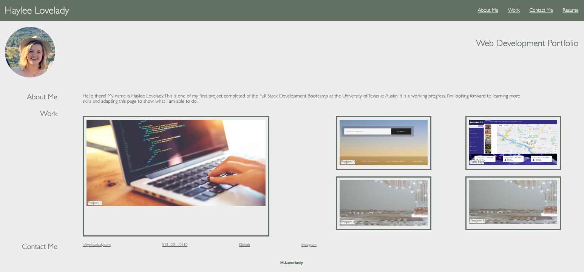

# Portfolio

## User Story

```
AS AN employer
I WANT to view a potential employee's deployed portfolio of work samples
SO THAT I can review samples of their work and assess whether they're a good candidate 
for an open position
```

## Acceptance Criteria

Here are the critical requirements necessary to develop a portfolio that satisfies a 
typical hiring manager’s needs:

```
GIVEN I need to sample a potential employee's previous work
WHEN I load their portfolio
THEN I am presented with the developer's name, a recent photo or avatar, 
and links to sections about them, their work, and how to contact them
WHEN I click one of the links in the navigation
THEN the UI scrolls to the corresponding section
WHEN I click on the link to the section about their work
THEN the UI scrolls to a section with titled images of the developer's applications
WHEN I am presented with the developer's first application
THEN that application's image should be larger in size than the others
WHEN I click on the images of the applications
THEN I am taken to that deployed application
WHEN I resize the page or view the site on various screens and devices
THEN I am presented with a responsive layout that adapts to my viewport
```

## Acceptance Criteria Met

```
-User can load portfolio
-User is presented with the developer's name, a recent photo or avatar, 
and links to sections about them, their work, and how to contact them 
when selecting one of the links in the navigation
-The UI scrolls to the corresponding section when selecting one of the links 
in the navigation
-The UI scrolls to a section with titled images of the developer's applications 
click on the link to the section about their work
-User can click on first image in the "work" section, user is presented with the 
developer's first application
-The first application's image is larger in size than the others
-User is taken to that deployed application when user selects the images of the 
applications
```

## Acceptance Criteria Not Completely Met

```
-User is NOT presented with a responsive layout that adapts to their viewport 
when they resize the page or view the site on various screens and devices. 
This was attempted but not fully complete.
```


## Screenshot of Webpage



## Deployed Application
https://hlovelady.github.io/Portfolio/
